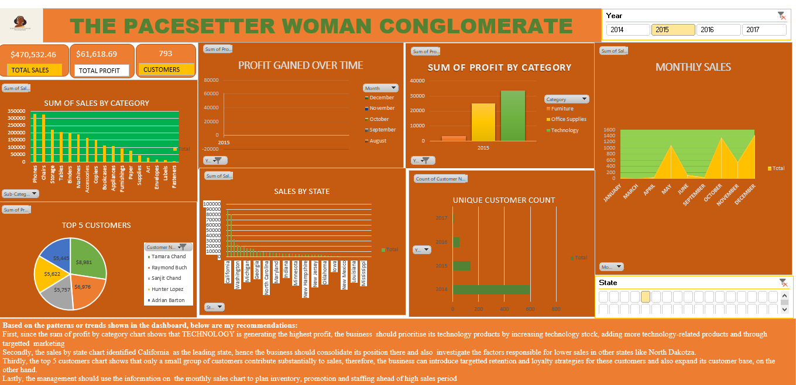

# The-US- Sales-Analysis-for-The-Pacesetter-Woman-Conglomerate-
The data for this analysis was retrieved from kaggle.com. It was cleaned and analysed with Microsoft Excel tool, the visualization was also designed on Excel. It focused on the client's business problems and answered questions geared towards helping the organisation make informed decisions. 
Data Cleaning & Preparation: The dataset was converted into a structured Excel table and appropriately formatted for analysis. Sales, Quantity, and Profit were converted to number formats, while Order Date was formatted and sorted chronologically. Month and Year columns were added to support time-based analysis and visualization.
Data Analysis & Visualization: The cleaned data was analyzed using PivotTables, charts, and slicers to identify sales, profit, customer, and geographical trends. Visualizations included funnel, line, area, pie, bar, and map charts covering sub-category sales, profit over time, monthly sales, top customers, sales by state, and customer count. These insights were consolidated into an interactive dashboard for dynamic data exploration.
Lastly, insights from the analysis were summarised clearly and concisely to interpret and communicate the results of the analysis.

